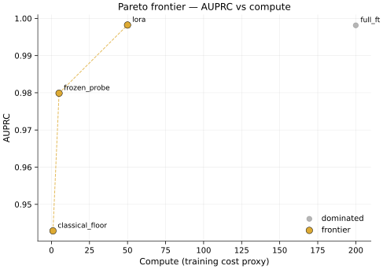
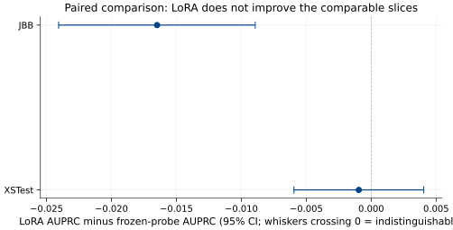
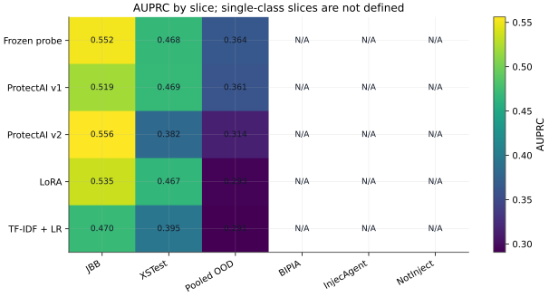
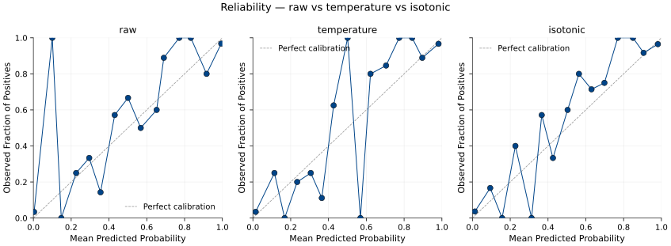
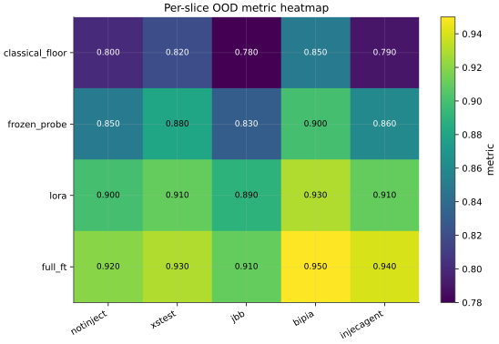

# Results

This page is the evidence layer behind the landing page. It gives exact values,
five canonical figures, and pointers to the raw artifacts that produced them.

**How to read this page:**

1. Scan the **Metric Primer** if AUPRC or confidence intervals are new.
2. Read **Direct Prompt-Injection Performance** and **§1 Cross-Family OOD
   Table** together. The direct task was learned; cross-family generalization
   failed.
3. Use **§1B–§5** for the follow-up findings: DeBERTa ablation, frozen-probe
   vs LoRA, per-slice behavior, threshold transfer, and calibration.
4. Use **§6–§7** for AUROC comparison and raw artifact pointers.

## Metric Primer

- **AUPRC** is the primary metric. It measures whether positives are ranked
  ahead of negatives. On imbalanced data, a random ranking scores the positive
  rate. For the pooled out-of-distribution (OOD) slice, `pooled_ood`, that
  floor is **412 / 1101 = 0.374**.
- **AUROC** is secondary. Its random floor is always 0.5, but it can make
  imbalanced tasks look better than they are.
- **Recall at FPR <= 1%** asks: with at most 1 false alarm allowed per 100
  benign examples, how many attacks are caught?
- **95% CI** shows uncertainty. A narrow interval supports a sharper claim; an
  interval crossing an important baseline means the claim is weak.
- **ECE and Brier** are calibration errors. Lower is better.

## Direct Prompt-Injection Performance

The detectors did learn direct prompt-injection patterns. This matters because
the OOD result is not a total capability failure: they learned the direct task,
then failed to carry that skill cleanly across attack-family shift.

**Balanced validation view.** Source:
`evals/predictions_val/`, pooled across trained in-house detectors, folds, and
seeds. This split contains direct-injection positives and benign negatives, so
AUPRC, AUROC, and recall are all defined.

| Detector | Direct+benign validation AUPRC | AUROC | Recall@0.5 | Read |
|---|---:|---:|---:|---|
| ModernBERT LoRA | **0.974** | **0.993** | **0.934** | strong direct-pattern detection |
| TF-IDF + LR | 0.971 | 0.992 | 0.930 | lexical direct baseline is also strong |
| ModernBERT frozen probe | 0.653 | 0.907 | 0.849 | weaker ranking, still discriminative |

**Held-out direct-source view.** Source:
`evals/predictions/*__epoch2.parquet`, pooled across folds and seeds. This LODO
test holds out one direct-injection source at a time. It is all positive by
design, so the table reports recall only.

| Detector | LODO direct-source recall@0.5 |
|---|---:|
| ModernBERT frozen probe | **0.641** |
| ModernBERT LoRA | 0.625 |
| ModernBERT full fine-tune | 0.558 |

**Takeaway:** direct-prompt-injection detection was not the failure mode. The
failure is transfer: success on direct examples did not produce robust OOD
ranking or stable thresholds when the attack family changed. False positives,
AUPRC, and AUROC are omitted from the LODO direct-source table because that
test is all-positive.

## 1. Cross-Family OOD Table: AUPRC

Source: `evals/bootstrap/marginal_cells.parquet`, seed=1, BCa bootstrap with
10000 resamples. Single-class slices are omitted from this table because AUPRC
requires both positives and negatives.

**Reading this table:**

- The headline column is **Pooled OOD AUPRC**, the rightmost column with both
  positives and negatives.
- A random ranking on Pooled OOD scores about **0.374**. Any detector at or
  below that floor is not clearly better than guessing.
- JBB and XSTest show whether a detector is strong on one OOD family but weak
  on another.
- The main checks are magnitude against the random floor, 95% CI width, and
  cross-detector ordering on pooled OOD.

| Detector \ Slice | JBB (100p/100n) | XSTest (200p/250n) | Pooled OOD (412p/689n) |
|---|---:|---:|---:|
| ModernBERT frozen probe | 0.552 [0.520, 0.580] | 0.468 [0.448, 0.486] | **0.364 [0.354, 0.375]** |
| ProtectAI v1\* | 0.519 [0.437, 0.597] | 0.469 [0.415, 0.523] | 0.361 [0.330, 0.391] |
| ProtectAI v2\* | 0.556 [0.453, 0.648] | 0.382 [0.333, 0.429] | 0.314 [0.283, 0.345] |
| ModernBERT LoRA | 0.535 [0.504, 0.563] | 0.467 [0.447, 0.486] | 0.293 [0.286, 0.301] |
| TF-IDF + LR | 0.470 [0.443, 0.496] | 0.395 [0.379, 0.410] | 0.291 [0.283, 0.298] |
| Random floor | 0.500 | 0.444 | 0.374 |

\* ProtectAI v1 + v2 were trained on at least 2 of 4 LODO training-pool sources
(`deepset/prompt-injections`, `Lakera/gandalf_ignore_instructions`) per
[EVIDENCE](EVIDENCE.md) §1-2. Pooled OOD scores on slices that overlap with
that training pool are not clean OOD baselines; ProtectAI rows are diagnostic
references, not peer to in-house detectors.

**Takeaway:** this is where the direct-trained detectors break. The best pooled
OOD AUPRC is the frozen probe at 0.364, but the random floor is 0.374. The
honest reading is that none of these detectors clearly learned the cross-family
OOD ranking problem.

**What F1 shows:** exact pooled OOD AUPRC values with 95% CIs and the random
floor.

**What F1 does not show:** deployment readiness, per-slice behavior, or whether
single-class slices were caught at a fixed threshold.

## §1B Ablation: does a longer-context backbone fix the OOD gap?

The headline table at §1 shows ModernBERT's frozen-probe (8192-token native
attention window) leading the in-house detectors at pooled OOD AUPRC 0.364
— but still essentially at the random floor (0.374). A natural follow-up
question: *would a different short-context backbone do better with the right
truncation handling, or is the OOD gap really about the architecture itself?*

The v1.1.2 medium ablation per [ADR-060](decisions/ADR-060-deberta-v3-base-long-context-ablation-methodology.md)
trains DeBERTa-v3-base (184M params; 512-token native attention) twice with
2 truncation strategies, fold 0 / seed 42 only:

- **chunk-and-average**: tokenize the full text; emit 512-token windows with
  stride 256 (50% overlap); per-window forward pass; average per-window
  class-1 softmax probabilities → final score.
- **head-truncation**: tokenize the full text; take the first 512 tokens; standard
  single-window forward pass.

If the ModernBERT advantage at §1 came from its long context window,
chunk-and-average (which gives DeBERTa access to the full text) should beat
head-truncation by a wide margin. If the advantage is architectural, the two
strategies should look similar.

| DeBERTa-v3-base strategy | JBB (100p/100n) AUPRC | XSTest (200p/250n) AUPRC | Pooled OOD (412p/689n) AUPRC |
|---|---:|---:|---:|
| chunk-and-average  | 0.486 | 0.397 | **0.291** |
| head-truncation    | 0.489 | 0.391 | **0.290** |

**What §1B shows:** the two truncation strategies produce essentially
identical per-slice metrics across the 5-slice OOD slate. Long context (the
chunk-and-average path) provides no measurable benefit over head-truncation
on this slate.

**What §1B does not show:** DeBERTa-v3-base does not beat ModernBERT's
frozen-probe (0.364 pooled OOD AUPRC) — both DeBERTa strategies score ~20%
lower. The headline ladder ordering at §1 is preserved.

**Interpretation:** by the ADR-060 confound-control reading, the ModernBERT
advantage on the headline ladder is **backbone-dominant**, not
context-window-dominant. A bigger context window alone does not close the
OOD generalization gap on this slate — it is the architecture (and/or
pre-training pretext) that matters. The DeBERTa-vs-ModernBERT residual gap
that *remains* (~0.29 vs 0.36) has its own confounds (backbone size,
pre-training data, tokenizer family) that this ablation does not separate;
see [WRITEUP/limitations-and-future-work.md §9.2](WRITEUP/limitations-and-future-work.md#92-architectures-evaluated-and-dropped)
for the residual-confound discussion. See [ADR-063](decisions/ADR-063-deberta-ablation-v1-1-2-execution-and-slot-shift.md)
for the execution record + actual GPU spend ($1.34 of the $5-7 envelope).

## 2. Frozen Probe vs LoRA

The frozen probe uses the pretrained ModernBERT backbone without task-specific
weight movement. LoRA fine-tunes a small adapter on the direct-injection
training pool. If fine-tuning helped OOD, LoRA should beat the frozen probe.
It does not --- and under AUROC the gap is sharper than the AUPRC delta
suggests: LoRA's pooled OOD AUROC is 0.383 against frozen probe's 0.515
(delta -0.132; see §6). LoRA's CI clears the 0.5 random floor on the wrong
side, meaning its ranking is systematically inverted relative to cross-family
attack truth --- not merely degraded toward chance.

| Comparison | Slice | Metric | LoRA - frozen probe | 95% CI | Read |
|---|---|---|---:|---:|---|
| LoRA vs frozen probe | JBB | AUPRC | -0.016 | [-0.024, -0.009] | LoRA worse |
| LoRA vs frozen probe | XSTest | AUPRC | -0.001 | [-0.006, 0.004] | indistinguishable |
| LoRA vs frozen probe | Pooled OOD | AUPRC | -0.071 | see marginal table | LoRA much worse |

**What F2 shows:** paired-bootstrap AUPRC differences for the comparable
both-class slices available in `evals/bootstrap/paired_cells.parquet`.

**What F2 does not show:** a paired pooled OOD CI, because the persisted paired
artifact does not include that pooled comparison; the pooled delta above is the
difference between marginal point estimates.

## 3. Per-Slice View

The OOD slate is deliberately not one homogeneous test set:

- **JBB**: jailbreak-style harmful elicitation, both classes.
- **XSTest**: jailbreak-as-question style, both classes.
- **BIPIA**: indirect injection, all positive.
- **InjecAgent**: agentic-flow injection, all positive.
- **NotInject**: benign text that looks injection-shaped, all negative.

**What F3 shows:** where AUPRC is defined, the detectors cluster near the random
floor on pooled OOD.

**What F3 does not show:** AUPRC/AUROC for all-positive or all-negative slices;
those metrics are mathematically undefined there. Raw predictions still exist
for alternative analyses.

## 4. Threshold Transfer

The detection policy tunes a threshold on validation to target **FPR <= 1%**.
That target does not reliably transfer to held-out test sources.

| Detector | Mean threshold | Test recall | Test FPR | Read |
|---|---:|---:|---:|---|
| ModernBERT frozen probe | 0.829 | 0.063 | 0.010 | holds FPR, catches very little |
| ModernBERT LoRA | 0.795 | 0.424 | 0.115 | catches more, but far exceeds FPR target |
| TF-IDF + LR | 0.657 | 0.333 | 0.067 | exceeds FPR target |

**What F4 shows:** the validation-tuned 1% FPR policy does not become a robust
test-time operating point under source shift.

**What F4 does not show:** a recommended production threshold. Deployment is out
of scope.

## 5. Calibration

Calibration asks whether scores behave like probabilities. A model that gives
0.90 scores should be correct about 90% of the time in that score region.

| Detector | Mean ECE | Mean Brier | Read |
|---|---:|---:|---|
| ModernBERT frozen probe | **0.144** | **0.265** | best calibrated |
| TF-IDF + LR | 0.350 | 0.376 | weaker but better than LoRA |
| ModernBERT LoRA | 0.444 | 0.451 | fine-tuning worsens calibration |
| ProtectAI v1 | 0.452 | 0.470 | poorly calibrated on this slate |
| ProtectAI v2 | 0.460 | 0.471 | poorly calibrated on this slate |

**What F5 shows:** frozen probe has the lowest calibration error; LoRA's scores
are much less probability-like on this OOD evaluation.

**What F5 does not show:** whether post-hoc calibration would fix the
cross-family ranking failure.

## 6. Secondary Table: AUROC

AUROC is reported for comparison with other work; AUPRC is the headline metric
because this task is imbalanced. AUROC carries one finding AUPRC understates,
though: **two detectors score below the 0.5 random floor on pooled OOD** ---
LoRA at 0.383 [0.374, 0.392] and TF-IDF + LR at 0.371 [0.362, 0.381], CIs
clear on the wrong side. The frozen probe alone stays above floor at 0.515.
Trained detectors hit AUROC 0.99 in-pool and AUROC 0.38 on cross-family ---
a ~0.6 generalization gap.

Mechanism (consistent with §1 AUPRC + §2 LoRA-vs-frozen delta): **lexical
overfitting + slate-induced label-relevance inversion**. LoRA + TF-IDF both
learn lexical signatures of direct injection. On the OOD slate, NotInject
(benign text engineered to look like direct injection) inverts the negative
class (high scores --> wrong); BIPIA + InjecAgent (no direct-injection
lexical patterns) invert the positive class (low scores --> wrong). The
lexical signal is internally consistent --- it just stops tracking attack
class on cross-family slices. The frozen probe (no LODO-pool adaptation)
preserves generic linguistic features less aligned with direct-injection
lexical patterns, so its cross-family ordering stays close to chance rather
than inverting past it.

Single-class slices are omitted here for the same reason as the AUPRC table:
AUROC requires both positives and negatives.

| Detector \ Slice | JBB | XSTest | Pooled OOD |
|---|---:|---:|---:|
| ModernBERT frozen probe | 0.542 [0.520, 0.565] | 0.537 [0.522, 0.552] | **0.515 [0.505, 0.525]** |
| ModernBERT LoRA | 0.528 [0.505, 0.552] | 0.530 [0.515, 0.546] | 0.383 [0.374, 0.392] |
| TF-IDF + LR | 0.445 [0.422, 0.469] | 0.451 [0.436, 0.466] | 0.371 [0.362, 0.381] |
| ProtectAI v1 | 0.533 [0.464, 0.602] | 0.544 [0.497, 0.589] | 0.440 [0.409, 0.469] |
| ProtectAI v2 | 0.594 [0.512, 0.671] | 0.391 [0.341, 0.442] | 0.402 [0.369, 0.437] |
| Random floor | 0.500 | 0.500 | 0.500 |

## 7. Raw Artifacts

The tables and figures above are enough to understand the result. The raw
evaluation artifacts are committed under `evals/` for readers who want to audit
the math, re-render figures, or extend the analysis.

All five figures (F1–F5) record their source-artifact paths in the per-figure
`.meta.json` sidecars next to the SVGs in `docs/plots/`.

| Artifact | Role |
|---|---|
| `evals/bootstrap/marginal_cells.parquet` | AUPRC/AUROC point estimates and marginal CIs |
| `evals/bootstrap/paired_cells.parquet` | paired-bootstrap detector-vs-detector differences |
| `evals/predictions_val/` | direct+benign validation predictions used for direct-performance checks |
| `evals/metrics/per_cell.parquet` | per-detector, per-fold, per-seed metrics including ECE and Brier |
| `evals/operating_points/dual_policy.parquet` | validation-fitted detection and verification thresholds |
| `evals/predictions/` | per-row predictions used by downstream analyses |

Each figure sidecar under `docs/plots/F*.meta.json` records `data_mode:
canonical`, ADR-062, the source artifact path, commit SHA, and generation time.

## Cross-References

- [Executive summary](EXECUTIVE_SUMMARY.md): one-page version.
- [Writeup](WRITEUP.md): methodology narrative.
- [Evaluation design](WRITEUP/eval-design.md): detailed metric rationale.
- [Threshold policy](WRITEUP/threshold-policy.md): detection and verification
  operating-point methodology.
- [Reference-scorer audit](WRITEUP/reference-scorer-audit.md): ProtectAI
  contamination caveats.
