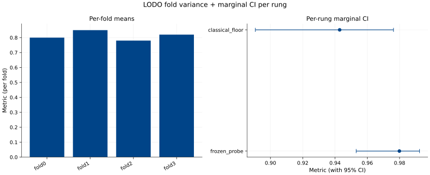
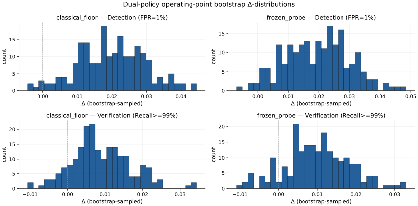

# Results

This page surfaces the model-run artifacts behind the headline finding. Per [ADR-054](decisions/ADR-054-results-page-as-third-entry-artifact-extending-adr-053.md) (narrow supersession of ADR-053 dimension 1), `RESULTS.md` is the third entry artifact in the reading-guide architecture — the data-disclosure surface for reviewers who want the actual numbers + figures + raw-data files.

**For interpretation framing** (prevalence baseline, cross-family OOD, negative-LoRA-delta meaning, ProtectAI non-monotone, val→LODO threshold transfer) start with [`index.qmd`](index.qmd). Those 5 interpretation patterns are required there per ADR-053 dimension 4 and not duplicated here.

**For the 1-page distillation** see [`EXECUTIVE_SUMMARY.md`](EXECUTIVE_SUMMARY.md).

**For full methodology** see [`WRITEUP.md`](WRITEUP.md) + the 8 spokes.

---

## How to read this page

The 5-rung × 5-slice grid presented below shows every (rung, slice) cell the project ran inference on. Multi-class slices (`jbb_behaviors`, `xstest`, `pooled_ood`) carry full AUPRC + AUROC + recall@FPR1% with 95% BCa CIs. Single-class slices (`bipia`, `injecagent`, `notinject`) carry `N/A` for AUPRC/AUROC because those metrics are mathematically undefined when only one class is present (no negatives → no FPR; no positives → no recall) — per the [ADR-050 single-class-slice convention](decisions/ADR-050-rung-slate-narrowing-llm-judges-and-full-ft-ood-dropped.md). The raw prediction parquets for single-class slices are still on disk at `evals/predictions/<rung>__<fold>__<seed>__<slice>.parquet` and linked in §5 below.

AUPRC's random-predictor floor equals the positive prevalence on the slice — **NOT** 0.5. For pooled_ood the prevalence baseline is 0.3742 (412 positives / 1101 rows). Falling below the prevalence baseline means the classifier's ranking is anti-correlated with the label on that slice; it does not mean "the model is bad" in some absolute sense — it means the slice is genuinely cross-family from training. See [`WRITEUP/eval-design.md` §5.1](WRITEUP/eval-design.md) for the AUPRC vs AUROC framing.

---

## §1 — AUPRC grid (5 rungs × 5 slices; BCa CI, 10000 resamples; seed=1)

Source: [`evals/bootstrap/marginal_cells.parquet`](https://github.com/brandon-behring/prompt-injection-detection-prototype/tree/v1.0.5/evals/bootstrap/marginal_cells.parquet). Single-class slices marked `N/A`; pointer to raw predictions in §5.

| Rung \ Slice                         | jbb_behaviors (n=200; 100p/100n)         | xstest (n=450; 200p/250n)               | pooled_ood (n=1101; 412p/689n)          | bipia (n=50; all positive) | injecagent (n=62; all positive) | notinject (n=339; all negative) |
|---|---|---|---|---|---|---|
| ModernBERT frozen-probe              | 0.552 [0.520, 0.580]                     | 0.468 [0.448, 0.486]                    | **0.364 [0.354, 0.375]**                | N/A *                       | N/A *                           | N/A *                           |
| ModernBERT LoRA                      | 0.535 [0.504, 0.563]                     | 0.467 [0.447, 0.486]                    | 0.293 [0.286, 0.301]                    | N/A *                       | N/A *                           | N/A *                           |
| TF-IDF + LR (classical floor)        | 0.470 [0.443, 0.496]                     | 0.395 [0.379, 0.410]                    | 0.291 [0.283, 0.298]                    | N/A *                       | N/A *                           | N/A *                           |
| ProtectAI v1 (reference)             | 0.519 [0.437, 0.597]                     | 0.469 [0.415, 0.523]                    | 0.361 [0.330, 0.391]                    | N/A *                       | N/A *                           | N/A *                           |
| ProtectAI v2 (reference)             | 0.556 [0.453, 0.648]                     | 0.382 [0.333, 0.429]                    | 0.314 [0.283, 0.345]                    | N/A *                       | N/A *                           | N/A *                           |
| **Random-predictor floor (prevalence)** | **0.500**                              | **0.444**                               | **0.374**                               | (undefined — all positive)  | (undefined — all positive)      | (undefined — all negative)      |

`*` AUPRC undefined for single-class slice per ADR-050; raw prediction parquet at [`evals/predictions/<rung>__fold0__seed42__<slice>.parquet`](https://github.com/brandon-behring/prompt-injection-detection-prototype/tree/v1.0.5/evals/predictions/).

**Reader notes**:

- **No rung clears the pooled_ood prevalence baseline (0.374)**. Best is frozen-probe at 0.364 — CI upper bound 0.375 just touches the baseline. This is the load-bearing negative result.
- **LoRA -0.071 vs frozen-probe on pooled_ood** (paired-bootstrap CI clears zero; see `evals/bootstrap/paired_cells.parquet`). Fine-tuning HURTS cross-family OOD.
- **ProtectAI v1 → v2 non-monotone**: v2 wins on jbb_behaviors (+0.037) but loses on xstest (-0.087) and pooled_ood (-0.047). Newer version does not uniformly improve.
- **On in-domain slices** (jbb_behaviors + xstest) all trained rungs clear the prevalence baseline; the wall is OOD-specific.

---

## §1B — Ablation appendix: DeBERTa-v3-base long-context comparator (v1.1.0 methodology lock; v1.1.1 execution)

**Methodology locked at v1.1.0; per-strategy AUPRC + AUROC grid pending v1.1.1 GPU fire.** Per [ADR-060](decisions/ADR-060-deberta-v3-base-long-context-ablation-methodology.md), the DeBERTa-v3-base medium ablation is **not** integrated as a 6th rung in the §1 headline ladder — it lands as an appendix here to isolate whether the ModernBERT OOD positioning is backbone-dominant or context-window-dominant.

Locked scope (per ADR-060 + [`NEXT_STEPS.md` §1.10](NEXT_STEPS.md)):

- **Backbone**: `microsoft/deberta-v3-base` (revision SHA pinned at v1.1.1 execution time).
- **Training scope**: 1 fold (fold 0), 1 seed (seed 42), 2 epochs (single LODO grid cell; ablation appendix, not co-equal rung).
- **Truncation strategies** (2 reported side-by-side; neither claimed canonical):
  - **chunk-and-average**: 512-token windows with stride 256 (50 % overlap); per-window forward pass; mean of per-window probabilities.
  - **head-truncation**: first 512 tokens only; standard single-window forward pass.
- **Eval slate**: full 5-slice OOD (BIPIA + InjecAgent + JBB-Behaviors + XSTest + NotInject); same slate as the §1 grid.
- **Compute envelope**: 1×L4 or 1×A100; ~30 min wall per fire; ~$5-7 GPU total for the sequential single-pod 2-fire shape (per [/exploring-options 2026-05-19 Q2 lock](decisions/ADR-060-deberta-v3-base-long-context-ablation-methodology.md); `lifecycle.on_success: recycle` per [#90](https://github.com/brandon-behring/runpod-deploy/issues/90) consumption + ADR-059); well within [ADR-020](decisions/ADR-020-runpod-orchestration-and-cost-discipline.md) $200 hard cap.

Infrastructure scaffolds landed at v1.1.0:

- [`configs/rungs/deberta_v3_base.yaml`](https://github.com/brandon-behring/prompt-injection-detection-prototype/tree/main/configs/rungs/deberta_v3_base.yaml) — hyperparameter recipe.
- [`configs/runpod/headline-deberta.yaml`](https://github.com/brandon-behring/prompt-injection-detection-prototype/tree/main/configs/runpod/headline-deberta.yaml) — RunPod orchestration config (lifecycle: recycle for the 2-fire shape).
- `Makefile` targets: `train-deberta-v3`, `eval-deberta-v3`, `deberta-ablation` (currently stubbed; exit 2 with v1.1.1-carryforward pointer per ADR-060).

v1.1.1 landing condition (per ADR-060): `make deberta-ablation` exits 0 with per-truncation-strategy AUPRC + AUROC entries in `evals/metrics/per_cell_deberta.parquet`; this §1B placeholder replaced with the real per-strategy × 5-slice grid; ~$5-7 GPU spend recorded in `evals/cost_ledger.csv`.

The /exploring-options 2026-05-19 scope-mismatch resolution (Path B): the existing training pipeline is ModernBERT-specific by construction (loader hardcodes `MODERNBERT_BASE_HF_ID`), so adding DeBERTa requires loader-refactor + windowed-inference module + eval-pipeline integration BEFORE any GPU fire. v1.1.0 lands the **methodology + infrastructure scaffold** (this section + the configs + Makefile stubs + ADR-060); v1.1.1 lands the **execution** (loader refactor + 2 GPU fires + populated results).

---

## §2 — AUROC grid (5 rungs × 5 slices; cross-paper diagnostic; secondary metric)

Source: same parquet. AUROC's random-predictor floor is 0.5 regardless of prevalence; it over-states performance under class imbalance compared to AUPRC. Reported here as a secondary diagnostic per [ADR-006](decisions/ADR-006-statistical-protocol-floor.md) + [`WRITEUP/eval-design.md` §5.1](WRITEUP/eval-design.md). Use AUPRC for primary interpretation.

| Rung \ Slice                  | jbb_behaviors          | xstest                 | pooled_ood             | bipia | injecagent | notinject |
|---|---|---|---|---|---|---|
| ModernBERT frozen-probe       | 0.542 [0.520, 0.565]   | 0.537 [0.522, 0.552]   | **0.515 [0.505, 0.525]** | N/A * | N/A *      | N/A *     |
| ModernBERT LoRA               | 0.528 [0.505, 0.552]   | 0.530 [0.515, 0.546]   | 0.383 [0.374, 0.392]   | N/A * | N/A *      | N/A *     |
| TF-IDF + LR (classical floor) | 0.445 [0.422, 0.469]   | 0.451 [0.436, 0.466]   | 0.371 [0.362, 0.381]   | N/A * | N/A *      | N/A *     |
| ProtectAI v1 (reference)      | 0.533 [0.464, 0.602]   | 0.544 [0.497, 0.589]   | 0.440 [0.409, 0.469]   | N/A * | N/A *      | N/A *     |
| ProtectAI v2 (reference)      | 0.594 [0.512, 0.671]   | 0.391 [0.341, 0.442]   | 0.402 [0.369, 0.437]   | N/A * | N/A *      | N/A *     |
| **Random-predictor floor**    | **0.500**              | **0.500**              | **0.500**              | (undefined) | (undefined) | (undefined) |

`*` AUROC undefined for single-class slice; same rationale as §1.

**Reader notes**:

- Only frozen-probe's pooled_ood CI [0.505, 0.525] clears chance (0.5) — and the margin is ~1.5%.
- LoRA and TF-IDF+LR pooled_ood AUROCs are far below 0.5 — the score ordering is genuinely anti-correlated with the label on cross-family OOD.
- LoRA matches frozen-probe on in-domain slices (jbb + xstest) but collapses on OOD. The fine-tuning specializes the head onto direct-injection structure at the cost of the cross-family signal.

---

## §3 — Recall @ FPR ≤ 1 % grid (operational policy slice; mean across 4 folds × 3 seeds = 12 cells)

Source: [`evals/metrics/per_cell.parquet`](https://github.com/brandon-behring/prompt-injection-detection-prototype/tree/v1.0.5/evals/metrics/per_cell.parquet); see [`WRITEUP/threshold-policy.md` §7](WRITEUP/threshold-policy.md) for the dual-policy convention.

| Rung \ Slice                  | jbb_behaviors | xstest  | pooled_ood | bipia       | injecagent  | notinject   |
|---|---|---|---|---|---|---|
| ModernBERT frozen-probe       | 0.040         | 0.011   | 0.003      | N/A *       | N/A *       | (FPR-only)  |
| ModernBERT LoRA               | 0.022         | 0.015   | 0.000      | N/A *       | N/A *       | (FPR-only)  |
| TF-IDF + LR (classical floor) | 0.011         | 0.004   | 0.003      | N/A *       | N/A *       | (FPR-only)  |
| ProtectAI v1 (reference)      | 0.000         | 0.000   | 0.000      | N/A *       | N/A *       | (FPR-only)  |
| ProtectAI v2 (reference)      | 0.000         | 0.000   | 0.000      | N/A *       | N/A *       | (FPR-only)  |

`*` Recall@FPR1% requires both positives + negatives — undefined for single-class slices. For `notinject` (all-negative), only FPR is defined (recall is mathematically undefined when there are zero positives); the dual-policy FPR-only audit is in `evals/operating_points/dual_policy.parquet`.

**Reader notes**:

- At the operational FPR ≤ 1 % threshold, all 5 rungs recall **< 5 %** of positives on every multi-class slice. This is the load-bearing operational finding: a low-false-alarm-budget deployment catches almost nothing on the OOD slate.
- ProtectAI v1 + v2 native cutoffs are not threshold-tunable for this policy; their recall@FPR1% reads as 0.000 because their native operating point lands far from the 1% FPR target. See [`WRITEUP/reference-scorer-audit.md`](WRITEUP/reference-scorer-audit.md) for the reference-rung policy framing.

---

## §4 — Figures (Phase 4 slate per ADR-046)

7 SVG figures rendered at commit [`948c50a`](https://github.com/brandon-behring/prompt-injection-detection-prototype/commit/948c50a) (v1.0.1; post Item-4 single-class filter; fresh). Provenance JSON at `docs/plots/F<N>.meta.json`.

### F1 — Pareto

### F2 — ROC overlay

### F3 — PR per rung

### F4 — Reliability triptych

### F5 — Per-slice heatmap

### F6 — LODO breakdown

### F7 — Dual-policy grid

---

## §5 — Raw-data access (direct GitHub blob URLs at tree/v1.0.5)

Every per-cell prediction + every bootstrap artifact + every per-(rung, fold, seed) operating point is on disk + on GitHub at the v1.0.5 tag. Reviewer can clone the repo OR click any link below to read the raw artifact.

| Artifact | Description | Link |
|---|---|---|
| `evals/results.json` | Per-rung headline metrics + 95% CIs (HF Hub T0 source per ADR-032 + ADR-034) | [results.json](https://github.com/brandon-behring/prompt-injection-detection-prototype/tree/v1.0.5/evals/results.json) |
| `evals/metrics/per_cell.parquet` | Per-(rung, fold, seed, slice) metrics: AUPRC + AUROC + recall@FPR{0.1,1,5}% + ECE + Brier | [per_cell.parquet](https://github.com/brandon-behring/prompt-injection-detection-prototype/tree/v1.0.5/evals/metrics/per_cell.parquet) |
| `evals/bootstrap/marginal_cells.parquet` | BCa 95% CI per cell (10000 resamples; seeds 1 + 2 for stability) | [marginal_cells.parquet](https://github.com/brandon-behring/prompt-injection-detection-prototype/tree/v1.0.5/evals/bootstrap/marginal_cells.parquet) |
| `evals/bootstrap/paired_cells.parquet` | Paired-bootstrap rung-vs-rung deltas (Efron-Tibshirani protocol per ADR-022) | [paired_cells.parquet](https://github.com/brandon-behring/prompt-injection-detection-prototype/tree/v1.0.5/evals/bootstrap/paired_cells.parquet) |
| `evals/bootstrap/paired_cells_seed2.parquet` | Paired-bootstrap stability sweep (seed=2 vs seed=1; 0/40 cells flagged) | [paired_cells_seed2.parquet](https://github.com/brandon-behring/prompt-injection-detection-prototype/tree/v1.0.5/evals/bootstrap/paired_cells_seed2.parquet) |
| `evals/audit/cross_fold_ci_audit.parquet` | cv_clt_ci (Bayle 2020) + block-bootstrap-on-folds sensitivity per ADR-024 | [cross_fold_ci_audit.parquet](https://github.com/brandon-behring/prompt-injection-detection-prototype/tree/v1.0.5/evals/audit/cross_fold_ci_audit.parquet) |
| `evals/audit/mde_per_cell.parquet` | Minimum detectable effect per (rung, slice, metric) for CIs containing zero | [mde_per_cell.parquet](https://github.com/brandon-behring/prompt-injection-detection-prototype/tree/v1.0.5/evals/audit/mde_per_cell.parquet) |
| `evals/audit/verification_reachability.json` | Per-(rung, fold, seed) reachability of recall ≥ 99 % verification target per ADR-025 + A-009 | [verification_reachability.json](https://github.com/brandon-behring/prompt-injection-detection-prototype/tree/v1.0.5/evals/audit/verification_reachability.json) |
| `evals/operating_points/dual_policy.parquet` | Detection (FPR ≤ 1 %) + verification (recall ≥ 99 %) thresholds per ADR-025 | [dual_policy.parquet](https://github.com/brandon-behring/prompt-injection-detection-prototype/tree/v1.0.5/evals/operating_points/dual_policy.parquet) |
| `evals/predictions/` | 282 per-row prediction parquets (all rungs × folds × seeds × epochs × OOD slices) | [predictions/ tree](https://github.com/brandon-behring/prompt-injection-detection-prototype/tree/v1.0.5/evals/predictions/) |
| `evals/predictions_val/` | Per-row validation predictions (12 files: 4 rungs × 4 folds × 3 seeds; val slice) | [predictions_val/ tree](https://github.com/brandon-behring/prompt-injection-detection-prototype/tree/v1.0.5/evals/predictions_val/) |
| `evals/data_audit.json` | Per-source counts + length distributions + dedup drops + class balance + A-005 trigger audit | [data_audit.json](https://github.com/brandon-behring/prompt-injection-detection-prototype/tree/v1.0.5/evals/data_audit.json) |
| `evals/dedup_calibration.json` | Calibrated semantic-dedup cosine threshold (50-pair golden holdout per ADR-016) | [dedup_calibration.json](https://github.com/brandon-behring/prompt-injection-detection-prototype/tree/v1.0.5/evals/dedup_calibration.json) |
| `evals/leakage_report.json` | Post-split leakage scrub (exact-hash + cosine ≥ 0.85) | [leakage_report.json](https://github.com/brandon-behring/prompt-injection-detection-prototype/tree/v1.0.5/evals/leakage_report.json) |
| `evals/contamination_scan.json` | A-005 trigger scan (MiniLM cosine eval-row → known-injection-template; 0 fires) | [contamination_scan.json](https://github.com/brandon-behring/prompt-injection-detection-prototype/tree/v1.0.5/evals/contamination_scan.json) |
| `evals/cost_ledger.csv` | Cumulative GPU spend (final: $15.74 vs $200 hard cap per ADR-020) | [cost_ledger.csv](https://github.com/brandon-behring/prompt-injection-detection-prototype/tree/v1.0.5/evals/cost_ledger.csv) |

### Single-class slice predictions (per ADR-050 N/A disclosure)

Although AUPRC/AUROC are undefined for single-class slices, **raw inference predictions still exist on disk** + on GitHub. Reviewers wanting to compute alternative metrics (recall on all-positive slices, FPR on all-negative slice, calibration on either) can pull the parquets directly:

- `evals/predictions/<rung>__fold0__seed42__bipia.parquet` (50 rows; all positive; indirect injection; [tree link](https://github.com/brandon-behring/prompt-injection-detection-prototype/tree/v1.0.5/evals/predictions/))
- `evals/predictions/<rung>__fold0__seed42__injecagent.parquet` (62 rows; all positive; multi-turn agentic; [tree link](https://github.com/brandon-behring/prompt-injection-detection-prototype/tree/v1.0.5/evals/predictions/))
- `evals/predictions/<rung>__fold0__seed42__notinject.parquet` (339 rows; all negative; false-positive probe; [tree link](https://github.com/brandon-behring/prompt-injection-detection-prototype/tree/v1.0.5/evals/predictions/))

Rungs available for each: frozen_probe, lora, tfidf-lr, protectai-v1, protectai-v2.

---

## §6 — Reproducibility

3 tiers per [ADR-034](decisions/ADR-034-reproducibility-tier-full-ladder.md) — see [`index.qmd` reading guide](index.qmd) for the canonical tier table; brief mirror here:

| Tier | Command | Verifies |
|---|---|---|
| **T0** | `make eval-from-hub RUNG=frozen-probe` + `RUNG=lora` | Headline scores reproduce on HF Hub checkpoint within 1e-4 absolute |
| **T1** | `make test-smoke` | Code health; no GPU; no network |
| **T3** | `make headline-cloud` | Full retraining from scratch (~$28; ~hours) |

ADR-051 v1.0.x carryforward note: `scripts/eval_from_hub.py` non-dry-run body lands in v1.1.x. The HF Hub model cards at [BBehring/prompt-injection-frozen-probe](https://huggingface.co/BBehring/prompt-injection-frozen-probe) + [BBehring/prompt-injection-lora](https://huggingface.co/BBehring/prompt-injection-lora) are live as of v1.0.1 + carry the same metric tables surfaced above.

---

## Cross-references

- [`index.qmd`](index.qmd) — Reading guide with 5 interpretation patterns (governed by ADR-053 dimension 4; mandatory pedagogy on the reading guide).
- [`EXECUTIVE_SUMMARY.md`](EXECUTIVE_SUMMARY.md) — 1-page thesis + 4 headline claims (governed by ADR-053 + ADR-054).
- [`WRITEUP.md` §Results](WRITEUP.md) — methodology-rooted narrative of the same finding.
- [`WRITEUP/eval-design.md` §5](WRITEUP/eval-design.md) — AUPRC vs AUROC framing, BCa CI rationale, paired-bootstrap protocol.
- [`WRITEUP/threshold-policy.md` §7](WRITEUP/threshold-policy.md) — dual-policy detection + verification threshold methodology.
- [`WRITEUP/reference-scorer-audit.md`](WRITEUP/reference-scorer-audit.md) — ProtectAI v1/v2 contamination + native-cutoff framing.
- [ADR-046](decisions/ADR-046-phase-4-walkthrough.md) — Phase 4 figure-rendering implementation.
- [ADR-050](decisions/ADR-050-rung-slate-narrowing-llm-judges-and-full-ft-ood-dropped.md) — single-class-slice convention + rung-slate narrowing.
- [ADR-053](decisions/ADR-053-reading-guide-governance-and-newcomer-paths.md) — reading-guide governance (now narrowly superseded on dimension 1 by ADR-054; dimensions 2-5 unchanged).
- [ADR-054](decisions/ADR-054-results-page-as-third-entry-artifact-extending-adr-053.md) — third entry artifact governance (this page).
